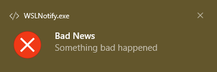

**This project is obsolete. I don't plan on updating it. I found a better way
to determine the active window ID and send native notifications on Windows, and
integrated it with my configurations files in
[tfpf/dotfiles](https://github.com/tfpf/dotfiles).**

# Native Windows Notifications for WSL
`notify-send` doesn't work on WSL. `WSLNotify.exe` may be used instead. You can
grab it from the
[latest release](https://github.com/tfpf/WSLNotify/releases/latest).

## Legal Notice
'WSL' stands for 'Windows Subsystem for Linux'. This project is not developed
or endorsed by Microsoft. It is mainly inspired by
[stuartleeks/wsl-notify-send](https://github.com/stuartleeks/wsl-notify-send).

## Usage
The following commands were run in Bash on Windows Terminal after navigating to
the directory containing `WSLNotify.exe`. (If you use Windows Command Prompt,
type `WSLNotify` instead of `./WSLNotify.exe` while entering these commands.)

```
./WSLNotify.exe "Summary Goes Here"
```


```
./WSLNotify.exe "Summary Goes Here" "Body goes here"
```


```
./WSLNotify.exe -i "dialog-information" "Good News" "Something good happened"
```


```
./WSLNotify.exe -i "dialog-warning" "News" "Something happened"
```


```
./WSLNotify.exe -i "dialog-error" "Bad News" "Something bad happened"
```


As of now, only the `-i` option is supported, and only for the three stock
icons seen above. Support for the `-u` (for urgency) and `-t` (for expire time)
options may never be added, because Windows notification display times are
based on system accessibility settings.

## Use Case
I created this package so that my command timer would also work on WSL. On
GNU/Linux, if you add the following to `~/.bashrc` (or perhaps
`~/.bash_aliases`):
```bash
before_command ()
{
    [ -z "${__busy+.}" ] && __busy=1
}

after_command ()
{
    unset __busy
    notify-send "Command Complete"
}

trap before_command DEBUG
PROMPT_COMMAND=after_command
```
you will get a notification every time a terminal command gets completed. With
a little more work, you can make it so that the notification reports the
elapsed time if the terminal is not the currently active window. To emulate the
same behaviour on WSL (which behaves like a headless system, whereby
notifications and active windows are meaningless), Windows notifications and
Windows window IDs can be used.

## Known Bugs
* Hovering the mouse over the system tray icon after the application has
returned makes the notification disappear.
* Multiple notifications fill up the system tray with the application icon.
* The `-i` option does not work on Windows 11.
