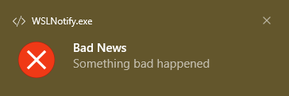

# Native Windows Notifications for WSL
`notify-send` doesn't work on WSL. `WSLNotify.exe` may be used instead. You can
grab it from one of the [releases](https://github.com/tfpf/WSLNotify/releases).

The following commands were run in Bash on Windows Terminal after navigating to
the directory containing `WSLNotify.exe`. (If you use Windows Command Prompt,
type `WSLNotify` instead of `./WSLNotify.exe` while entering these commands.)

```
./WSLNotify.exe "Summary Goes Here"
```


```
./WSLNotify.exe "Summary Goes Here" "Body goes here"
```


```
./WSLNotify.exe -i "dialog-information" "Good News" "Something good happened"
```


```
./WSLNotify.exe -i "dialog-warning" "News" "Something happened"
```


```
./WSLNotify.exe -i "dialog-error" "Bad News" "Something bad happened"
```


As of now, only the `-i` option is supported, and only for the three stock
icons seen above. Support for the `-u` (for urgency) and `-t` (for expire time)
options may never be added, because Windows notification display times are
based on system accessibility settings.

# Configuration Files
`config` contains my personal configuration files for Bash and GVIM (and some
other applications). These can be used on GNU/Linux or WSL without making any
changes whatsoever. Having identical files for both means I don't have to spend
time setting up my environment.

# Known Bugs
* Hovering the mouse over the system tray icon after the application has
returned makes the notification disappear.
* Multiple notifications fill up the system tray with the application icon.

